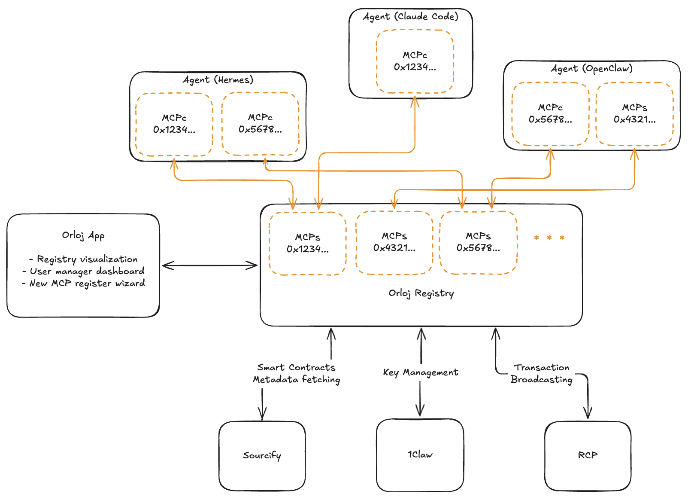

# Orloj Registry

> *Orloj* (Czech for "astronomical clock") — started at **ETHPrague Hackathon 2026**, extended at **ETH Global Lisboa 2026**.

Orloj exposes on-chain capabilities to AI agents as **MCP (Model Context Protocol) servers**. Sourcify-verified contracts become typed MCP tools; signing stays in a **pluggable KMS** (1Claw or SpaceComputer Orbitport). Agents use bearer tokens — they never hold keys, pick RPCs, or pay gas themselves.

At Lisboa we added a second layer: a **Graph-powered Uniswap V3 LP manager** that ZeroClaw can invoke as a specialized MCP. Chat stays conversational; LP decisions stay fail-closed and audit-traced.

## Highlights

- **Sourcify ABI → typed MCP server, dynamically generated.** Every function in a verified contract becomes an MCP tool (alloy `JsonAbi` / `DynSolValue`), including proxy ABIs via Sourcify `proxyResolution`.
- **Hardware-rooted, pluggable KMS.** Orbitport (orbital HSM + SpaceTEE) or 1Claw (HSM + TEE). Same agent surface either way; keys never leave the enclave.
- **Agents never hold a key.** Registry builds EIP-1559 txs, signs digests via KMS, broadcasts. Compromised host cannot forge beyond authorized digests.
- **Per-agent bearer tokens.** `mcpk_live_*` keys, constant-time checked against Postgres; revocation is a row update.
- **Hand-written Uniswap MCP (Sepolia LP + trading).** `quote` / `swap`, plus V3 liquidity tools (`list_v3_positions`, `get_v3_position`, ergonomic `create_v3_position`, `decrease_v3_position`, `claim_v3_fees`, pool reads).
- **Graph LP Manager (`@orloj/lp-agent`).** Live Uniswap V3 subgraph evidence → deterministic features → specialized 0G inference (`HOLD` | `REDUCE_LIQUIDITY` | `REBALANCE`) → guarded Orloj Uniswap MCP plans, with stateful rebalance recovery.
- **Chat bridge.** App-hosted `POST /api/lp-agent/mcp` exposes `orloj-lp-manager` in the MCP picker. ZeroClaw supervises; `runOnce()` remains the specialist. Execute is server-gated (`LP_AGENT_CHAT_EXECUTE_ENABLED`).

## Hackathon tracks / bounties

**ETHPrague 2026 (foundation)**

- Ethereum Core — [`ETHEREUM-CORE.md`](ETHEREUM-CORE.md)
- Network Economy — [`NETWORK-ECONOMY.md`](NETWORK-ECONOMY.md)
- [Sourcify](https://ducttapeevents.notion.site/Sourcify-2fe1a305cfe7805c87a7ce855ae2bde6) — [`SOURCIFY.md`](SOURCIFY.md)
- [SpaceComputer](https://ducttapeevents.notion.site/SpaceComputer-3101a305cfe7801ca388f3bc292f148d) — [`SPACECOMPUTER.md`](SPACECOMPUTER.md)
- Best UX Flow

**ETH Global Lisboa 2026 (this worktree)**

- The Graph — live subgraph evidence for LP decisions (no RPC market fallback)
- Uniswap — Sepolia V3 LP + Trading API via Orloj MCP
- Agent UX — ZeroClaw chat → Graph LP Manager MCP → one audited cycle

## The Problem It Solves

AI agents can talk about DeFi, but safely *acting* on-chain (and *managing* LP risk with fresh market evidence) is still hard:

- keys, RPCs, gas, and ABIs are footguns;
- generic chat models should not invent ticks, pools, or remint loops;
- LP decisions need **fresh indexed market data** and a full audit trail.

Orloj removes the custody/gas surface via MCP + KMS, and at Lisboa adds a **specialist LP agent** grounded in The Graph so chat can analyze (and, when enabled, manage) existing Sepolia Uniswap V3 positions without rewriting the whole stack as free-form tool soup.

## How It Works

**1. Sourcify-driven MCP generation.** Verified metadata → dynamic MCP tools per ABI function.

**2. Pluggable KMS vaults.** 1Claw or Orbitport; registry signs digests only.

**3. Uniswap MCP.** Chain-agnostic trading tools + Sepolia-only V3 LP management, authenticated per Orloj agent.

**4. Graph LP pipeline (`packages/lp-agent`).**

```
discover active positions (list_v3_positions)
  → get_v3_position + The Graph pool market context
  → extractFeatures (fail closed on stale/missing Graph)
  → specialized AI decision (strict citations)
  → planAction (HOLD / decrease / decrease→swap→create)
  → observe (no writes) or execute (guarded + state file)
```

**5. Chat bridge.** ZeroClaw selects `orloj-lp-manager` → `analyze_uniswap_v3_positions` (always observe) or `manage_uniswap_v3_positions` (only if execute flag on). Config is server-pinned; the model cannot pass wallet/chain/NFT/mode/retry.



## Challenges We Ran Into

- **Uniswap LP semantics** — `decrease_v3_position` also collects fees; claim-before/after-decrease is unsafe; create needed ergonomic token+budget inputs and list/reconcile tooling.
- **Graph freshness ≠ activity** — sparse `PoolHourData` / swaps with a fresh `_meta` is an inactive market, not a stale indexer; USD fields on Sepolia are conditionally reliable.
- **Rebalance safety** — single-sided out-of-range principal needs an optional swap leg; replacement NFT reconciliation must be baseline-aware (do not adopt a sibling position that already existed); create remint must be one-shot and operator-gated.
- **Chat vs specialist** — ZeroClaw auto-approves tools, so execute must be a **server flag**, not a prompt. Analyze can recommend REDUCE/REBALANCE while still refusing writes; the chat may still offer Uniswap MCP `decrease_v3_position` if that MCP is also selected — different path from Graph LP Manager execute.
- **Local Supabase pooling** — session pooler (`:5432`) for sqlx/registry vs transaction pooler (`:6543`) for the Next.js `pg` pool; mixing them incorrectly surfaces `EMAXCONNSESSION` or prepared-statement errors.

## Technologies Used

**Registry** ([packages/registry/](packages/registry/)) — Rust, axum, rmcp, alloy, sqlx; Uniswap Trading + Liquidity APIs.

**App** ([packages/app/](packages/app/)) — Next.js 16, React 19, Better-Auth (SIWE + magic link), ZeroClaw ACP sessions, internal LP Manager MCP route.

**LP agent** ([packages/lp-agent/](packages/lp-agent/)) — Node ≥24.15, zero runtime npm deps, The Graph gateway (Bearer), OpenAI-compatible chat completions (0G).

**On-chain & data** — Sourcify, 1Claw, Orbitport, viem, Uniswap v3 (Sepolia), [The Graph](https://thegraph.com/) Uniswap V3 Sepolia subgraph.

## Run It Locally

```bash
cp packages/registry/.env.example packages/registry/.env
cp packages/app/.env.example      packages/app/.env
# optional CLI LP agent:
cp packages/lp-agent/.env.example packages/lp-agent/.env
```

Fill at least:

- **Registry** — `DATABASE_URL`, Uniswap API key(s), KMS credentials as needed. Prefer session pooler (`:5432`) for sqlx.
- **App** — `DATABASE_URL` (transaction pooler `:6543` is fine for Node), `BETTER_AUTH_SECRET`, `REGISTRY_URL`, and for the Graph LP chat bridge: `LP_AGENT_MCP_URL`, `THE_GRAPH_API_KEY`, `LP_AGENT_AI_*`, `LP_AGENT_CHAT_EXECUTE_ENABLED=false`. Install `zeroclaw` on PATH for chat sessions.
- **LP agent (CLI)** — Orloj MCP URL + bearer, Graph key, AI endpoint/key/model.

```bash
# Terminal A — registry (:3001)
cd packages/registry && cargo run

# Terminal B — app (:3000)
cd packages/app && pnpm install && pnpm dev
# or: pnpm build && pnpm start

# Optional — one-shot LP agent without chat
cd packages/lp-agent && AGENT_MODE=observe node --env-file=.env src/run-once.mjs
```

Node **24.15.0** and pnpm **10.33.2** are pinned. Keep `LP_AGENT_CHAT_EXECUTE_ENABLED=false` until you intentionally run a Sepolia write demo.

More detail: [packages/lp-agent/README.md](packages/lp-agent/README.md), [packages/app/docs/lp-agent-chat-bridge.md](packages/app/docs/lp-agent-chat-bridge.md).
